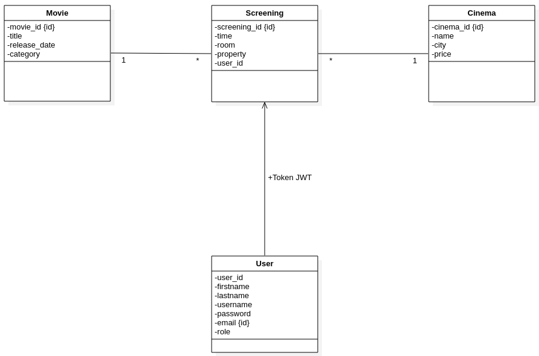
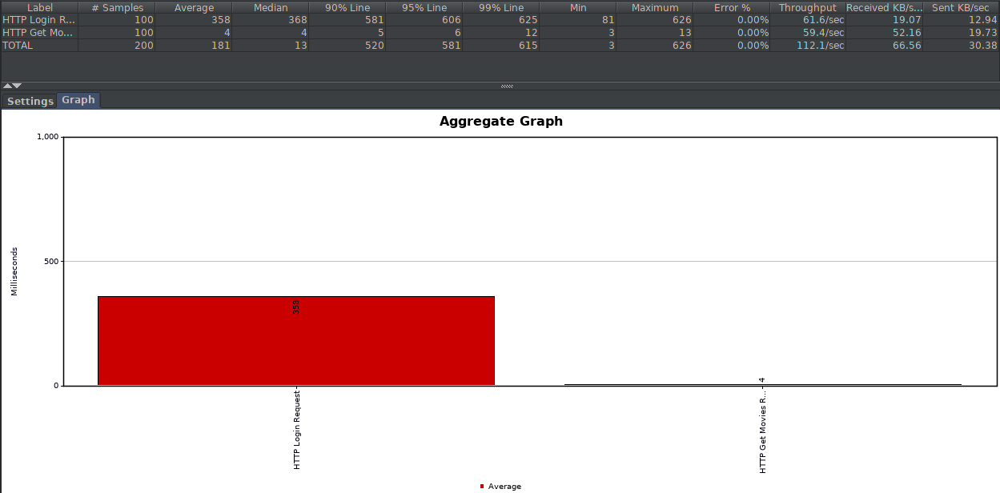
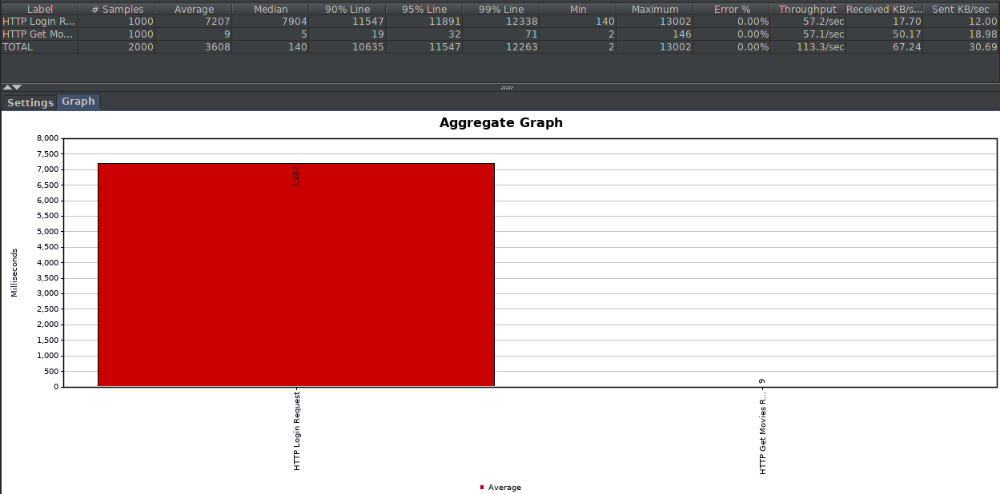
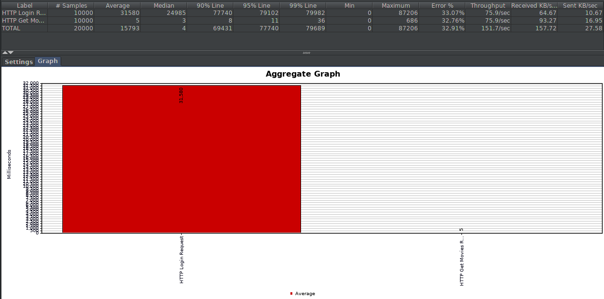

# Rapport AMT Projet 2
## Introduction
Ce projet a pour but de designer, spécifier et implémenter 2 API REST à l'aide du framwork Spring Boot. La première API s'occupe de la partie authentification de l'utilisateur. La deuxième API s'occupe de la gestion des entités business de notre application.

Les technologies Spring Boot, Spring Data et Spring MVC sont utilisés pour implémenter les "endpoints" ainsi que la partie "données persistantes".

La technologie Swagger (Open API) est utilisée pour générer du code à partir de la spécification de base des API (top-down) puis pour générer une documentation formelle des API implémentées (top-up).

Le lien entre les 2 API se fait à travers de tokens JWT.

Des tests de type BDD "Behavior Driver Development" sont effectués avec Cucumber.
Des tests de charges sont effectués avec JMeter.

## Implementation
**Diagramme du user domain et du business domain**

Concernant l'API user, nous avons implémenté les fonctionnalités suivantes :
- Tous les comptes ont un id (autogénéré), prénom, nom, username, un mot de passe (hashé dans la DB), un email (unique) et un rôle.
- Les utilisateurs peuvent créer des comptes utilisateurs. Une fois authentifiés, ils peuvent mettre à jour les champs de leur compte respectifs excépté leur id. Ils n'ont aucun accès aux autres comptes enregistrés dans la DB.
- Les comptes administrateurs ne peuvent pas être créés depuis l'application, ils existent depuis l'initialisation de l'application, En revanche, un administrateur peut changer le rôle d'un autre compte pour le faire devenir administrateur et vis-vers-ça. Un compte administrateur peut visualiser, modifier ou supprimer n'importe quel compte existant dans la DB.
- Il existe 3 types de DTO dans la spécification Swagger pour déterminer l'objet user :
-- `UserFull` : Il contient tous les champs de `user` existant dans la DB.
-- `UserManage` : Il contient tous les champs de `user` existant dans la DB excépté l'`id`.
-- `UserAuth` : Il contient uniquement le `username` et le `password`.
- La pagination est implémentée pour afficher la liste des utilisateurs existant (uniquement pour les administrateurs). Les arguments `pageId` et `pageSize` permettent de définir le format des pages.

Concernant l'API entités, nous avons repris les entités utilisées dans le projet 1, à savoir : des cinémas, des films, et des séances de films dans des cinémas.
Nous avons implémenté les fonctionnalités suivantes :
- Les opérations CRUD sont implémentés sur les 3 entités. Pour les cinémas et les films tous les utilsateurs peuvent effectués toutes les opérations CRUD. En revanche pour les séances, les utilisateurs peuvent effectués ces opérations uniquement sur les séances leur appartenant. Les administrateurs peuvent effectuées les opérations CRUD sur l'ensemble des séances.
- Les séances dépendent des films et des cinémas existant, il y a donc une contrainte de type cascade sur ses entrés. C'est à dire que si un film ou un cinéma lié à une séance est détruit, la séance est elle aussi détruite.
- Il existe 2 types de DTO dans la spécification Swagger pour déterminer les objets `screening`, `movie` et `cinema` :
-- `ScreeingFull` : Il contient tous les champs de `screening` existant dans la DB.
-- `MovieFull` : Il contient tous les champs de `movie` existant dans la DB.
-- `CinemaFull` : Il contient tous les champs de `cinema` existant dans la DB.
-- `ScreeningManage` : Il contient tous les champs de `screening` existant dans la DB excépté le `screening_id` et le `user_id`.
-- `MovieManage` : Il contient tous les champs de `movie` existant dans la DB excépté le `movie_id`.
-- `CinemaManage` : Il contient tous les champs de `cinema` existant dans la DB excépté le `cinema_id`.
- La pagination est implémentée pour afficher la liste des films, cinémas et séances existants. Les arguments `pageId` et `pageSize` permettent de définir le format des pages.

Stratégie de test :
Pour chacune des APIs, les réponses aux requêtes on été testées.
Des requêtes valides et invalides ont été effectuées à l'aide de Cucumber. Ceci nous a permis de vérifier le comportement de l'API.

## Tests & Résultats
Tests BDD avec Cucumber :
// Mettre un screen des tests qui passent (user API + entities API) par ex.

Tests de charges avec JMeter :

**100 utilisateurs**

**1000 utilisateurs**

**10'000 utilisateurs**

## Conclusion
Ce projet nous a permis de prendre en main les frameworks Spring Boot et Cucumber. Ayant réalisé le projet 1 avec JavaEE, on réalise que malgré le fait que Spring boot se base sur les composants de JavaEE, une fois pris en main, il permet d'être très efficace et de déployer des applications complexes assez rapidement.
Cucumber quant à lui permet de mettre en place rapidement des tests de comportement d'API .

Les points difficiles concernant la partie développement des API à été la partie authentification. En effet, nous avons perdus pas mal de temps à essayer d'implémenter Spring Security pour manager la partie authentifcation. Après plusieurs tentatives, nous avons décidé de changer d'approche et d'utiliser l'authentification "classique" utilisée dans le projet 1. Spring Security est un composant très puissant qui permet de mettre en place des systèmes d'authentification et d'authorisation très poussé. Il n'est pas adapté pour notre petit projet et sa prise en main demandait trop d'effort par rapport à la taille de ce projet ainsi que du temps que nous avions à disposition.

La principale difficulté de Cucumber vient de sa principale qualité, à savoir que ce framework gère beaucoup de chose pour le développeur. Ce qui signifie qu'en cas de bug, trouver l'origine de l'erreur peut vite devenir compliqué.
